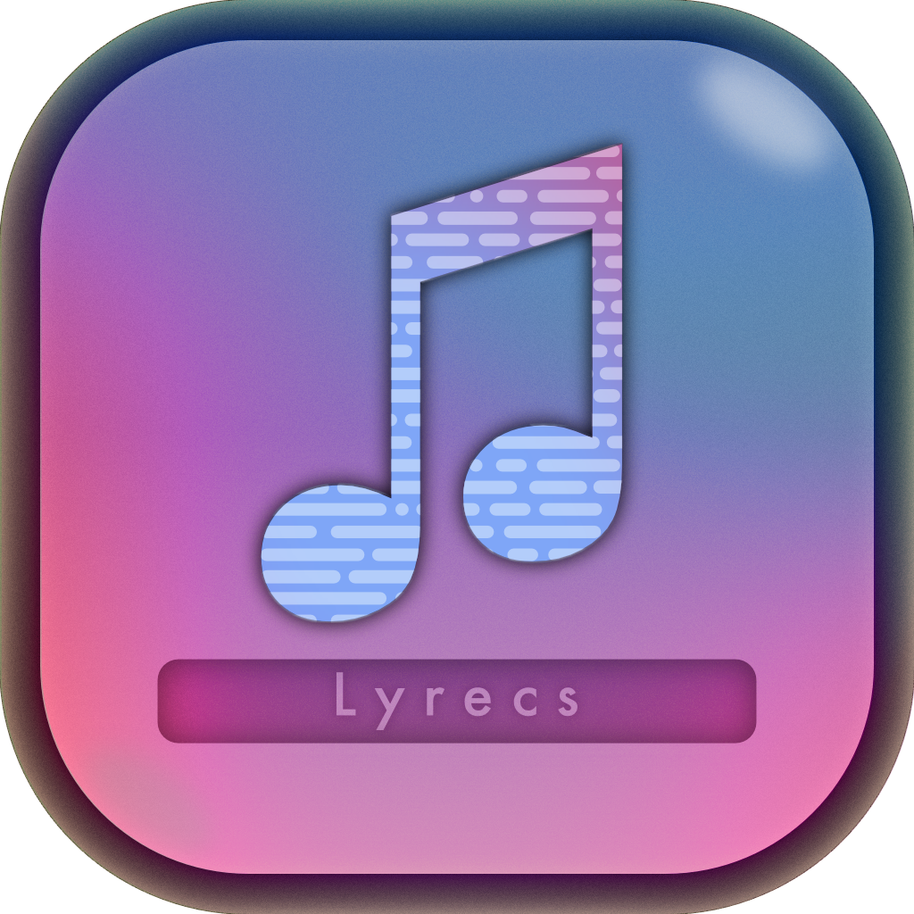
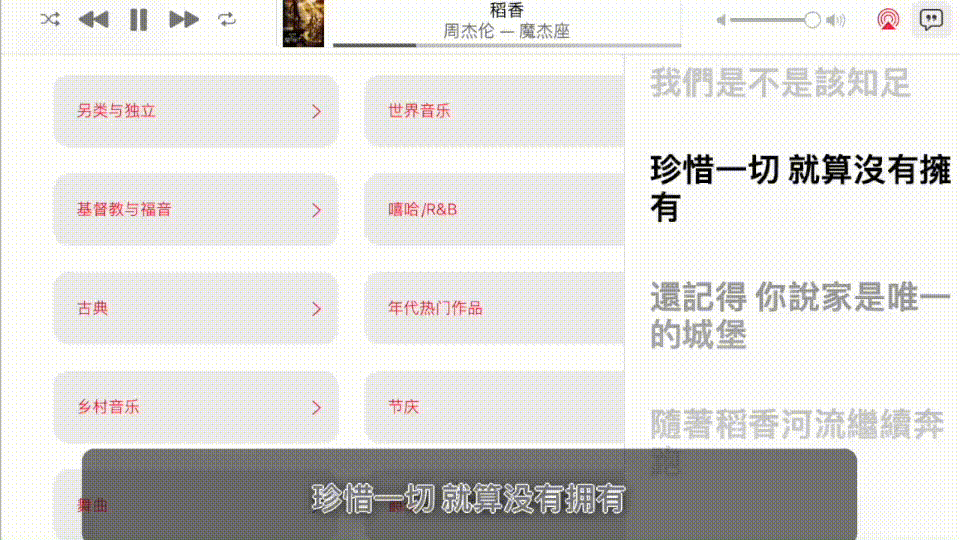

  

<h3 align="center">Lyrecs</h3>

  A lyrics displayer for Apple Music
   
  <a href="https://github.com/aizcutei/lyrecs/releases"><b>Download is not avaliable for now</b></a>

 

## Lyrecs

Lyrecs是一款跨平台的Apple Music的桌面动态歌词展示软件。Inspired by [LyricsX](https://github.com/ddddxxx/LyricsX)。WIP for now。

- 跨平台（Mac、Windows网页版）

- 自定义文件歌词样式

- 支持单字时间轴，歌词翻译（需歌词文件包含）

- and more...

## Build from source

- Install Rust and tauri on your device

- Clone this repository

- Run`cargo tauri build`